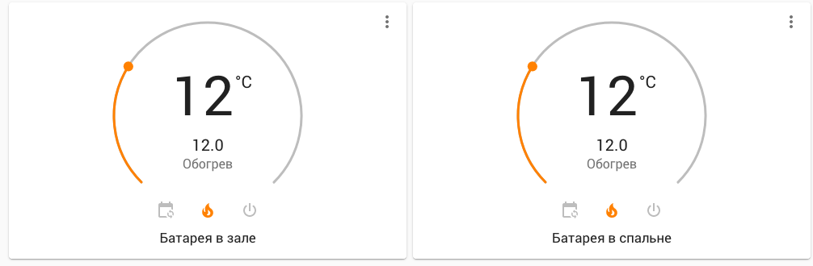

# Climate in a Smart Home

Autumn has come, and with it the heating season. This means that it is no longer comfortable to be at home without heating.

In the apartment where I live, there are radiators with valves for adjusting the flow of hot water, and each radiator is equipped with calorimeters that simplify the process of collecting heating consumption data (so it makes sense to save energy).

After comparing the available options for automating the heating in the apartment, I decided to buy [eQ3 Bluetooth thermostatic valves](https://www.eq-3.com/products/homematic/detail/bluetooth-smart-radiator-thermostat.html).



The main advantages of this solution are that they are:

- cheaper than thermostatic valves with other remote control interfaces
- do not require a hub for centralized control.

At the same time, they are slightly more expensive than regular thermostatic valves with programmable thermostats.

The manufacturer's application is implemented acceptably and has a convenient interface for scheduling settings.

The schedule is set for a week. It is possible to set an unlimited(?) number of temperature settings for each day of the week, as well as to copy days of the week to avoid repeating this procedure multiple times for weekends or weekdays.

The thermostatic valves have additional features such as a Boost mode and an open window detector.

The main drawback of these thermostatic valves is that they measure the temperature directly around the radiator.

## Ideal integration scenarios in a smart home

Next, I want to describe the ideal scenario for heating management in a smart home.

In Home Assistant, there is already a component for using thermostatic valves, which means that it is now possible to set the temperature directly from the Home Assistant interface without any additional configuration. All you need to do is find out the Bluetooth MAC address of the device.

I also decided not to change the settings from the application based on a schedule, as it is more convenient to configure temperature settings in one place.

At the moment, I have a configuration for two rooms. I use the [Scheduler component](https://github.com/nielsfaber/scheduler-component) and the [Lovelace scheduler card](https://github.com/nielsfaber/scheduler-card) to display it in the interface.

## Scenarios

When working from home, it is necessary to have the heating in the living room turned on in advance, from the moment of waking up until midday when the heating is no longer needed and the apartment remains warm until the evening.

In general, heating is not needed in the bedroom (it is more comfortable to sleep in a cooler environment), except for situations when it is necessary to manually heat the room, for example, for exercising.

It is necessary to always turn off the radiator in the bedroom after manual adjustment to avoid accidentally leaving it on and wasting a lot of energy.

It is necessary to completely turn off the heating, even in the living room, when all residents leave the house. Ideally, the apartment should be heated before the residents return home (taking into account the proximity to home).

In the living room, the heating target point should differ depending on the time of day. This means that it is necessary to create the ideal temperature near the workspace during working hours, and near the sofa and kitchen area in the evenings.

All of this will also require a properly configured presence detection component.

I will also try to set up integration with my alarm clock, so that the smart home starts heating the apartment in the morning based on the alarm clock time.

Using the [generic thermostat component](https://www.home-assistant.io/integrations/generic_thermostat/) will allow me to use a different temperature sensor as the target for turning on the heating. The thermostatic valve will be used as a simple switch in two states, on or off.

I don't think that using the maximum temperature and completely turning off the thermostatic valve is reasonable, as in this case, the valve will remain hot for a long time and overheat the room.

Ideally, something like [PID temperature control](https://en.wikipedia.org/wiki/PID_controller) should be implemented, gradually increasing the temperature in the valve and efficiently and accurately heating the room.

It is also necessary to use independent window opening sensors to automatically turn off the thermostatic valves when a window is open and airing is taking place. This issue is particularly relevant in the bedroom. This behavior should be compatible with the temperature schedule.

## Conclusion

Currently, none of this has been implemented yet. In the following parts, I will try to describe the steps to implement all the scenarios described in this blog post.